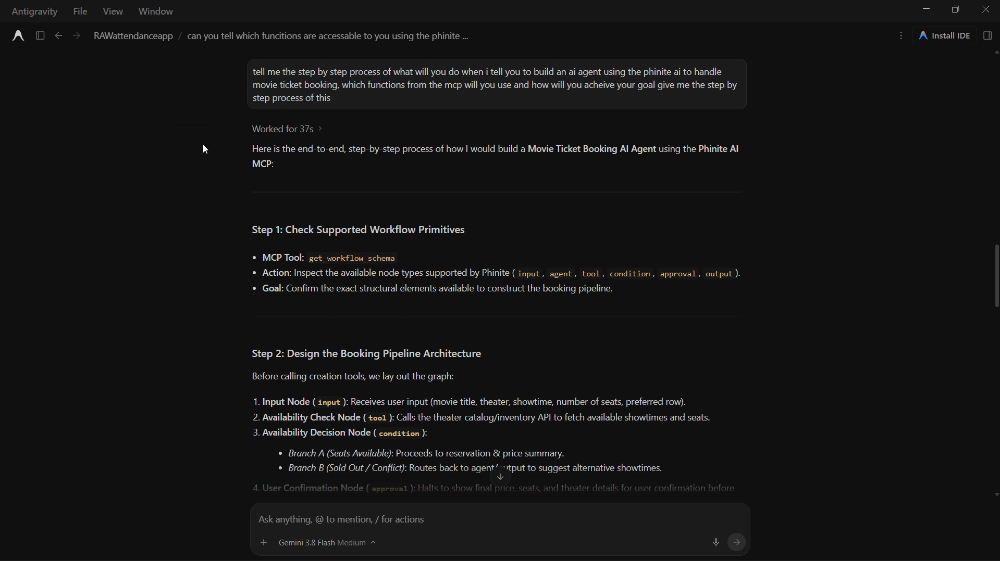
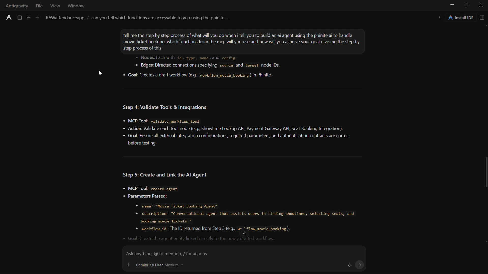
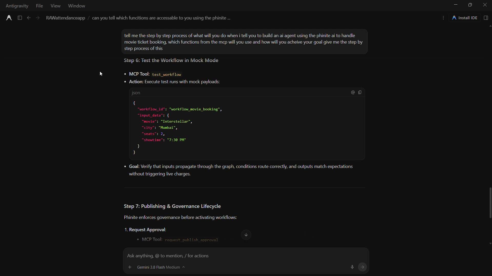

# Phinite MCP — Agent Platform Control Prototype

> **A proof-of-concept MCP server that allows AI coding agents to programmatically build, inspect, modify, validate, test, approve, and publish AI agent workflows.**
## Requirement of MCP in Phinite AI
I was a participant of Agent Labs Buildathon: Phinite × Paytm, when I was building I noticed that phinite AI's own AI assistant "Phinite Aura" was very useful, you just prompt it and it will generate the agent workflow, but after going through 3 to 4 iterations through prompts I was able to build a agent that can be used as a base agent that will still needs improvements and optimizations. Where I though that "Does Phinite has MCP ??", Googled it also asked the co-ordinators and come to know their isnt a MCP. I though if thier was a MCP then I can easily build the agent workflow using Claude in just 1 to 2 prompts and the system will be production level.
Now I am not saying that Aura is not a good model it is a awesome model , but the state we are in having SOTA models in your workplace is default.
So I thought I will build a Mock MCP server for Phinite AI that can enable using AI assistants like Claude, ChatGPT, Antigravity, etc in the Phinite Workplace.

Also their are three Business Insights behind building MCP for Phinite AI

1. User can Interact and build agent through Phinte but using their own AI assistant and familar interface.

2. If user use their own assistant for thinking, processing and building this will reduce the cost, the number of requests sent to Phinite Aura can be reduced, resulting in lower infrastructure usage and reduced server maintenance costs for Phinite.

3. This is my favorite, Claude has an estimated 12 million paid users/monthly and total of 56 million to 220 million monthly active users globally, ChatGPT has 1 billion/month and  35 million to 50 million unique paying subscribers and , AntiGravity has 2.5 million, etc. When users search for an MCP with a name similar to “Phinite AI,” there is a possibility that the official Phinite MCP could appear in the search results. This could create an unexpected discovery point where users who were not specifically looking for Phinite become curious about the company and explore its platform. As MCP adoption grows, this could become a valuable source of organic, targeted exposure to a large number of potential users.So potentially this will be free marketing to 100's of millions of potential users.

4. Also having your own MCP Server is very cool..  

## MCP testing in Antigravity

A short demonstration of the MCP in AntiGravity.

<p align="center">
  
  
  
</p>

[Watch the 30-second demo](assets/Phinite_AI_MCP_interaction_with_AntiGravity.mp4)
## Overview

This project shows a real use of **Model Context Protocol (MCP)** can be used as a programmatic control interface for an AI-agent platform such as Phinite.

Instead of manually building an agent through a visual interface, an AI coding agent such as **Antigravity** can interact with the platform through MCP tools.

For example, a user can ask:

> "Build me a customer support agent that classifies tickets, retrieves information from a knowledge base, performs sentiment analysis, requires human approval, and returns a response."

The AI agent can then use the MCP interface to:

1. Discover available workflow primitives
2. Create a workflow draft
3. Add and connect workflow nodes
4. Create and configure tools
5. Validate the workflow
6. Test the workflow
7. Request publication approval
8. Approve the workflow
9. Publish the workflow
10. Inspect the audit trail

The current implementation uses a **mock Phinite backend** so that the complete concept can be demonstrated without requiring access to Phinite's internal APIs.

---

# Architecture

```text
                  AI Coding Agent
                  Antigravity
                       │
                       │ MCP / STDIO
                       ▼
              ┌────────────────────┐
              │   Phinite MCP      │
              │      Server        │
              └─────────┬──────────┘
                        │
                        ▼
              ┌────────────────────┐
              │ Mock Phinite       │
              │ Backend            │
              ├────────────────────┤
              │ Agents             │
              │ Workflows          │
              │ Tools              │
              │ Versions           │
              │ Approvals          │
              │ Audit Logs         │
              └────────────────────┘
```

The intended production architecture would replace the mock backend with Phinite's existing service/API layer:

```text
                  AI Coding Agent
                         │
                         │ MCP / HTTPS
                         ▼
                 ┌───────────────┐
                 │  Phinite MCP  │
                 └───────┬───────┘
                         │
                  Auth / RBAC
                         │
                         ▼
                 ┌───────────────┐
                 │ Phinite APIs  │
                 │ / Services    │
                 └───────┬───────┘
                         │
                         ▼
                 Phinite Platform
```

---

# Why MCP?

The goal is **not** to create a separate MCP function for every possible business use case.

For example, the MCP should not need functions such as:

```text
search_movies()
book_movie()
book_flight()
book_hotel()
order_food()
...
```

Instead, the MCP exposes **platform-level primitives**.

The AI can use those primitives to construct agents for different domains.

```text
                 Phinite MCP
                      │
        ┌─────────────┼─────────────┐
        ▼             ▼             ▼
     Agents       Workflows       Tools
        │             │             │
        └─────────────┼─────────────┘
                      ▼
                 Agent Runtime
                      │
          ┌───────────┼───────────┐
          ▼           ▼           ▼
       Movie API   Payment API  CRM API
```

This allows the platform to support new use cases without continuously expanding the MCP API with domain-specific functions.

---

# MCP Tools

## Agent Management

```text
list_agents
get_agent
create_agent
```

## Workflow Management

```text
list_workflows
get_workflow
create_workflow_draft
add_workflow_node
add_workflow_edge
```

## Workflow Validation

```text
get_workflow_schema
validate_workflow_tool
```

## Tool / Integration Management

```text
list_tools
get_tool
create_tool
configure_tool
```

The tool abstraction is particularly important.

An AI agent can create a generic HTTP/API tool and configure it for a specific service rather than requiring a new MCP function for every business capability.

For example:

```text
create_tool(
    "Movie Search API",
    "Searches movies",
    "http"
)
```

followed by:

```text
configure_tool(
    "tool_1",
    {
        "method": "GET",
        "url": "https://example.com/api/movies"
    }
)
```

The same mechanism can be used for other APIs.

## Versioning

```text
get_workflow_versions
```

## Testing

```text
test_workflow
```

## Governance

```text
request_publish_approval
approve_publish
publish_workflow
```

## Audit

```text
get_audit_logs
```

---

# Example: Building a Movie Ticket Agent

A user could ask an AI coding agent:

> "Build me an AI agent that can help users find movies, check showtimes and seats, get confirmation, and book tickets."

The AI could construct a graph similar to:

```text
                    User Request
                         │
                         ▼
                  Booking Agent
                         │
                         ▼
                   Movie Search
                         │
                         ▼
                  Showtime Search
                         │
                         ▼
                 Seat Availability
                         │
                         ▼
                    Condition
                    /       \
              Available     Sold Out
                  │             │
                  ▼             ▼
             Confirmation    Alternatives
                  │
                  ▼
             Human Approval
                  │
                  ▼
                Payment
                  │
                  ▼
             Ticket Booking
                  │
                  ▼
               Output
```

Importantly, the MCP itself does not need a `search_movies()` function.

Instead, the AI can create/configure the required tools and compose them into the workflow.

---

# Example Interaction

### User

```text
Create a customer support agent.

It should:

- receive a support ticket
- classify the issue
- analyze sentiment
- search the knowledge base
- require human approval
- generate the response
```

### AI Agent

```text
get_workflow_schema()
        ↓
list_tools()
        ↓
create_workflow_draft()
        ↓
add_workflow_node()
        ↓
add_workflow_node()
        ↓
add_workflow_edge()
        ↓
validate_workflow()
        ↓
test_workflow()
        ↓
request_publish_approval()
```

After human approval:

```text
approve_publish()
        ↓
publish_workflow()
```

The audit trail can then be inspected using:

```text
get_audit_logs()
```

---

# Project Structure

```text
phinite-mcp-prototype/
│
├── server.py              # MCP server and tool definitions
├── backend.py             # Mock Phinite backend
├── models.py              # Domain models
├── validation.py          # Workflow validation
├── diff.py                # Workflow change comparison
├── AGENTS.md              # Instructions for AI coding agents
│
├── .agents/
│   └── mcp_config.json    # Antigravity MCP configuration
│
├── tests/
│   └── test_validation.py
│
├── requirements.txt
└── README.md
```

---

# Running the Prototype

## 1. Clone the repository

```bash
git clone <repository-url>
cd phinite-mcp-prototype
```

## 2. Create a virtual environment

### Windows

```powershell
python -m venv .venv
.venv\Scripts\activate
```

### Linux / macOS

```bash
python3 -m venv .venv
source .venv/bin/activate
```

## 3. Install dependencies

```bash
pip install -r requirements.txt
```

## 4. Configure the MCP client

Configure the MCP client to launch:

```text
.venv/Scripts/python.exe server.py
```

For Antigravity, the workspace MCP configuration can point to:

```text
.agents/mcp_config.json
```

Example:

```json
{
  "mcpServers": {
    "phinite-prototype": {
      "command": "C:\\path\\to\\phinite-mcp-prototype\\.venv\\Scripts\\python.exe",
      "args": [
        "C:\\path\\to\\phinite-mcp-prototype\\server.py"
      ],
      "cwd": "C:\\path\\to\\phinite-mcp-prototype"
    }
  }
}
```

The exact path should be changed for the local environment.

## 5. Start the MCP client

Once configured, the MCP client can start the server automatically through the configured command.

The server uses **STDIO transport** for the local prototype.

---

# Design Principles

### 1. Platform primitives instead of business-specific functions

The MCP should expose capabilities for manipulating the platform rather than every possible business operation.

### 2. Draft-first workflow

Mutations should generally happen against drafts rather than directly against production.

### 3. Validate before publish

A workflow should pass structural validation before publication.

### 4. Human approval for production changes

The prototype demonstrates an explicit approval step before publishing.

### 5. Auditability

Mutating operations generate audit events.

### 6. Extensible tools

Application-specific capabilities should be represented as configurable tools/integrations rather than hard-coded MCP functions.

---

# Current Prototype vs Production

This repository intentionally uses a mock backend.

| Component        | Prototype       | Production                  |
| ---------------- | --------------- | --------------------------- |
| MCP Server       | Implemented     | Reuse                       |
| Tool definitions | Implemented     | Refine/version              |
| Agent model      | Mock            | Phinite services            |
| Workflow model   | Mock            | Phinite services            |
| Tool registry    | Mock            | Phinite integration layer   |
| Persistence      | In-memory       | Existing database/services  |
| Authentication   | Not implemented | OAuth/token authentication  |
| Authorization    | Not implemented | RBAC / permissions          |
| Tenant isolation | Not implemented | Required                    |
| Transport        | STDIO           | Remote HTTPS MCP            |
| Approval         | Simulated       | Real authorization workflow |
| Audit            | In-memory       | Persistent enterprise audit |
| Deployment       | Local           | Cloud infrastructure        |
| Monitoring       | Not implemented | Logs/metrics/tracing        |

The prototype is therefore intended to demonstrate the **interaction model and architecture**, not to represent a production deployment.

---

# Production Integration Concept

The MCP layer can remain relatively thin.

```text
MCP Tool
   │
   ▼
Phinite Service/API
   │
   ▼
Phinite Platform
```

For example:

```python
@mcp.tool()
def get_workflow(workflow_id: str):

    return phinite_api.get_workflow(
        workflow_id
    )
```

The production MCP should not duplicate Phinite's core business logic.

---

# Future Direction

Potential extensions include:

* Remote MCP deployment
* OAuth authentication
* Workspace/tenant isolation
* RBAC enforcement
* OpenAPI → tool generation
* Tool discovery
* Workflow diffing
* Execution traces
* Evaluation workflows
* Persistent audit logs
* Environment-aware deployment
* Human approval policies
* Integration with external APIs
* Agent testing and evaluation

---

# Status

**Proof of Concept**

The current implementation demonstrates the core concept of using MCP as an AI-accessible control interface for an agent platform.

It is intentionally backed by a mock implementation so the concept can be evaluated independently of Phinite's internal APIs.

---

## Author

**Aryan Chougule**

AI/ML Engineer
Bengaluru, India
